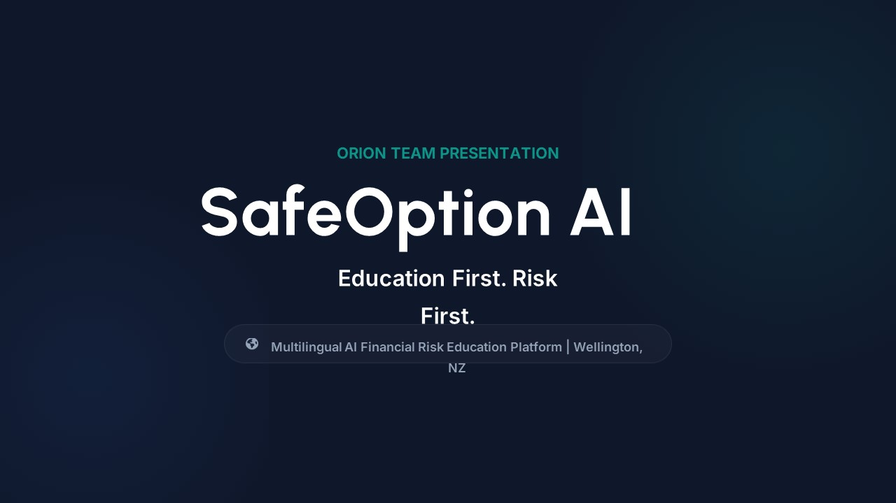
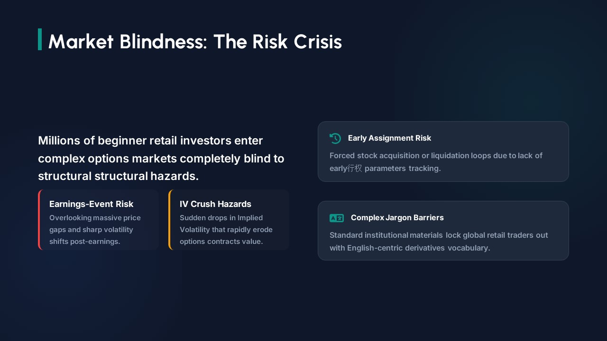
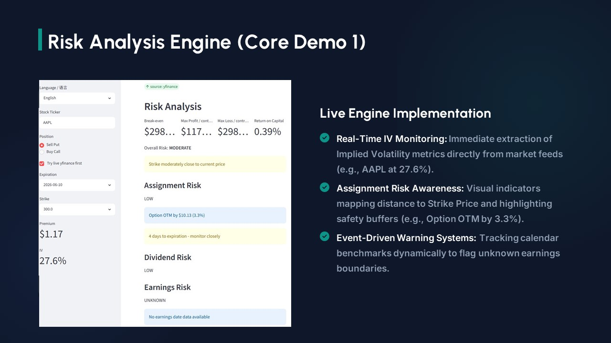
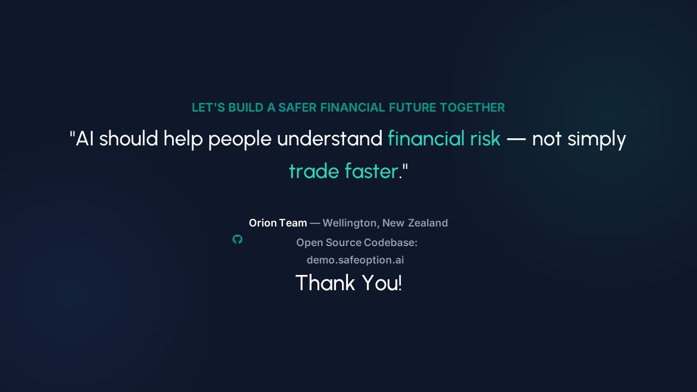

# SafeOption AI
SafeOption AI is an open-source educational platform focused on option risk awareness, financial education, and responsible investing.

The project combines AI-assisted learning, multilingual educational support, and modular risk analysis tools to help retail investors better understand option trading risks.

## Education First. Risk First.

SafeOption AI is an AI-powered multilingual option risk education platform designed for retail investors and beginner option traders.

This project focuses on helping users understand:

* Option Risk
* Sell Put Strategy
* Buy Call Basics
* Dividend Risk
* Assignment Risk
* Break-even Analysis
* Risk / Reward Structure

---

# Project Vision

Most retail traders lose money because they do not fully understand option risk.

SafeOption AI aims to:

* reduce financial learning barriers
* improve risk awareness
* provide multilingual financial education
* create AI-assisted educational guidance tools
* support responsible retail investing

This is NOT an automated trading system.

The project does NOT:

* execute trades
* connect to brokers
* manage user funds
* provide guaranteed investment returns

---

# Current MVP Scope

The initial MVP focuses on:

## 1. Sell Put Risk Calculator

Input:

* Stock Price
* Strike Price
* Premium
* Expiry Date

Output:

* Break-even
* Max Risk
* Annualized Return
* Assignment Risk
* Dividend Risk Warning

---

## 2. Buy Call Educational Module

Basic educational explanations:

* leverage
* time decay
* implied volatility
* risk structure

---

## 3. Multilingual Education Framework

Initial languages:

* English
* Chinese

Future expansion:

* Español
* 日本語
* 한국어
* हिन्दी

---

# Repository Structure

```text
architecture/        System design and diagrams
assets/              Images and visual resources
demo/                MVP demos and screenshots
docs/                Documentation
education_module/    Educational content
multilingual/        Language framework
risk_engine/         Risk calculation engine
roadmap/             Development roadmap
submissions/         Hackathon submissions
```

---

# Development Status

Current Stage:
Early MVP Development

Target:
Proof of Usefulness Hackathon Submission (June 2026)

---

# Collaboration

SafeOption AI is developed under the Orion Open AI Collaboration Framework.

We welcome:

* educators
* developers
* financial researchers
* multilingual contributors
* open-source collaborators

---

# License

MIT License

---

## MVP Scope

Current MVP focuses on educational and risk-awareness tools only.

This project does NOT provide:

- Automated trading
- Brokerage integration
- Real-money execution
- Financial guarantees
- High-frequency trading
- Personalized investment advice

The current MVP includes:

- Sell Put Risk Analysis
- Break-even Calculation
- Dividend Risk Checker
- Earnings Risk Checker
- Assignment Risk Analysis
- Bilingual Educational Explanation

## Technical Stack

Current technology stack:

- Python
- Streamlit
- yfinance
- GitHub
- Modular Risk Engine Architecture

## Project Structure

app/
risk_engine/
data/
docs/
demo/
tests/
future_modules/

## Future Expansion

SafeOption AI is designed as the first module of a broader educational financial framework:

- SafeFuture AI
- SafePortfolio AI
- SafeIncome AI

The long-term goal is to build a multilingual AI-assisted financial education ecosystem focused on risk awareness and responsible investing.

## Demo Video

Download the working prototype demo here:

[SafeOption AI Demo Video](demo/SafeOptionAI_Final_Submit.mp4)

---

## Pitch Deck

[Open Hackathon Pitch PDF](docs/submissions/SafeOption AI Hackathon Pitch-V3_Oreo G & Hai.pdf)

---

## Project Screenshots

### Risk Analysis Interface



### Educational Explanation Module



### SafeOption AI Demo Interface



### Final Presentation Slide


